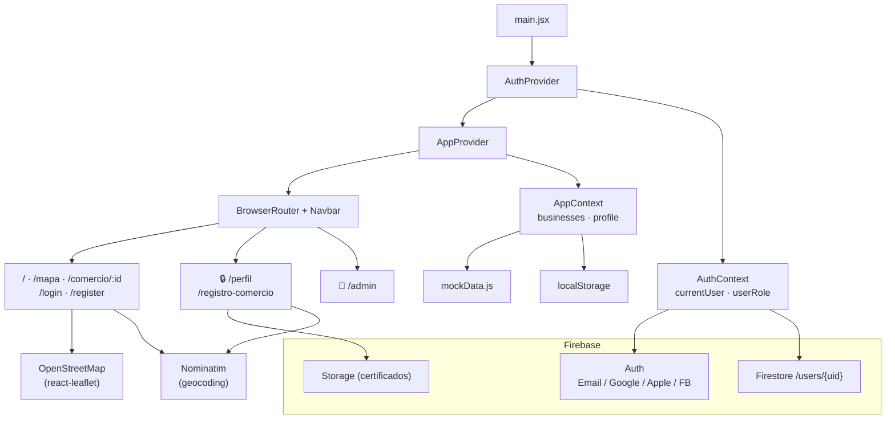

# Arquitectura — MapaApto

## Diagrama



---

## Capas del sistema

### 1. Entrypoint — `main.jsx`

Es el único archivo que monta la aplicación en el DOM. Su responsabilidad más importante —además de renderizar `<App>`— es importar el CSS de Leaflet de forma global, algo que debe ocurrir antes de que cualquier componente de mapa se renderice.

---

### 2. Árbol de providers

Los providers se anidan en un orden deliberado:

```
AuthProvider
  └── AppProvider
        └── BrowserRouter + Navbar
              └── Rutas
```

**`AuthProvider`** va al tope porque `AppProvider` puede necesitar saber quién es el usuario (por ejemplo, para asociar negocios a un UID). Si el orden fuera inverso, `AppContext` no podría leer `AuthContext`.

**`AppProvider`** inicializa el estado de negocios desde `mockData.js` y el perfil de usuario desde `localStorage`. Al estar por dentro de `AuthProvider`, tiene acceso al contexto de autenticación si lo necesita.

**`BrowserRouter`** va dentro de los providers para que los contextos estén disponibles en cualquier página, incluyendo dentro de rutas protegidas.

---

### 3. Contextos de estado

La aplicación tiene dos contextos independientes con responsabilidades distintas.

#### `AuthContext`

Gestiona la identidad del usuario. Expone:

| Valor / función | Descripción |
|---|---|
| `currentUser` | Objeto de Firebase Auth (o `null` si no hay sesión) |
| `userRole` | `"user"` o `"admin"`, leído de Firestore |
| `signInWithEmail` | Login con email y contraseña |
| `registerWithEmail` | Registro: crea la cuenta en Auth y el documento en Firestore |
| `signInWithProvider` | Login con Google, Apple o Facebook vía popup |
| `signOut` | Cierra la sesión en Firebase |

Al iniciar, `onAuthStateChanged` escucha el estado de sesión de Firebase. Cuando detecta un usuario, consulta `Firestore /users/{uid}` para obtener su rol. Esto evita que el cliente pueda auto-asignarse el rol `admin`.

#### `AppContext`

Gestiona los datos de negocio de la sesión. Expone:

| Valor / función | Descripción |
|---|---|
| `businesses` | Lista completa de negocios (verificados + pendientes) |
| `addBusiness` | Agrega un negocio nuevo con `{ verified: false, pending: true }` |
| `approveBusiness` | Cambia a `{ verified: true, pending: false }` |
| `rejectBusiness` | Elimina el negocio de la lista |
| `userProfile` | `{ name, restrictions[] }` persistido en `localStorage` |
| `updateProfile` | Actualiza y persiste el perfil |

Los negocios viven en memoria durante la sesión; `mockData.js` es la semilla inicial. El perfil del usuario es la única información que sobrevive entre sesiones, guardada bajo la clave `mapaApto_profile` en `localStorage`.

---

### 4. Firebase

Firebase actúa como backend remoto y tiene tres servicios activos:

| Servicio | Uso |
|---|---|
| **Auth** | Gestión de sesiones. Soporta email/contraseña, Google, Apple y Facebook. |
| **Firestore** | Almacena el documento `/users/{uid}` con `email`, `displayName`, `role`, `createdAt` y `lastLogin`. El campo `role` es la fuente de verdad para permisos de admin. |
| **Storage** | Recibe los archivos de certificación (RNPA, ALG, etc.) subidos desde el formulario de registro de comercio. |

---

### 5. Rutas

El router divide las rutas en tres grupos según nivel de acceso.

#### Rutas públicas

Accesibles sin sesión iniciada.

| Ruta | Página | Detalle |
|---|---|---|
| `/` | Home | Landing de presentación |
| `/mapa` | Mapa | Mapa interactivo con filtros |
| `/comercio/:id` | DetalleComercio | Ficha de un negocio |
| `/login` | Login | Formulario de ingreso |
| `/register` | Register | Formulario de registro |

#### Rutas privadas — `PrivateRoute 🔒`

`PrivateRoute` verifica que `currentUser` no sea `null`. Si el usuario no tiene sesión, redirige a `/login`.

| Ruta | Página |
|---|---|
| `/perfil` | Editor del perfil (restricciones) |
| `/registro-comercio` | Formulario de alta de negocio |

#### Ruta de admin — `AdminRoute 👑`

`AdminRoute` verifica que `userRole === "admin"`. El rol viene de Firestore, no del cliente. Si el usuario no es admin, redirige al inicio.

| Ruta | Página |
|---|---|
| `/admin` | Panel de aprobación/rechazo de negocios |

---

### 6. Servicios externos

#### OpenStreetMap + react-leaflet

`MapView` renderiza el mapa sobre tiles de OpenStreetMap. Cada negocio verificado aparece como un pin SVG coloreado por tipo de establecimiento. La página `/mapa` aplica dos filtros independientes (restricciones y tipos) con `useMemo` para evitar recálculos innecesarios.

#### Nominatim (geocoding)

El formulario `/registro-comercio` usa la API de Nominatim para convertir la dirección ingresada en coordenadas lat/lng. El mapa dentro del formulario es arrastrable, permitiendo ajuste fino de la ubicación. Se usa un `AbortController` para cancelar la petición anterior si el usuario sigue escribiendo, evitando condiciones de carrera.

---

## Flujo de vida de un negocio

```
Usuario registra negocio (/registro-comercio)
  → addBusiness() → { verified: false, pending: true }
  → Documento subido a Firebase Storage

Admin ingresa (/admin)
  → Ve negocios con pending: true
  → approveBusiness() → { verified: true, pending: false }  ← aparece en el mapa
  → rejectBusiness()  → eliminado de la lista
```

Solo los negocios con `verified: true` y `pending: false` son visibles en `/mapa`.
